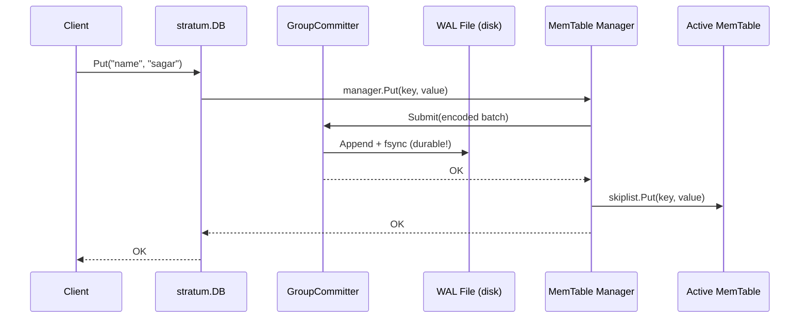
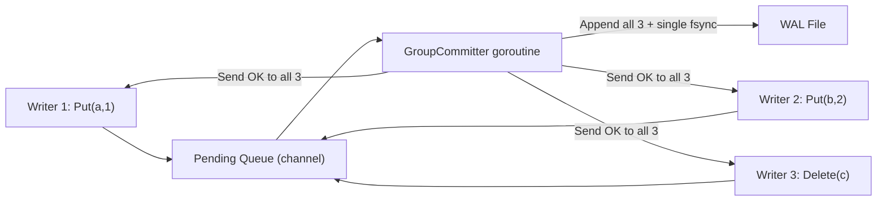
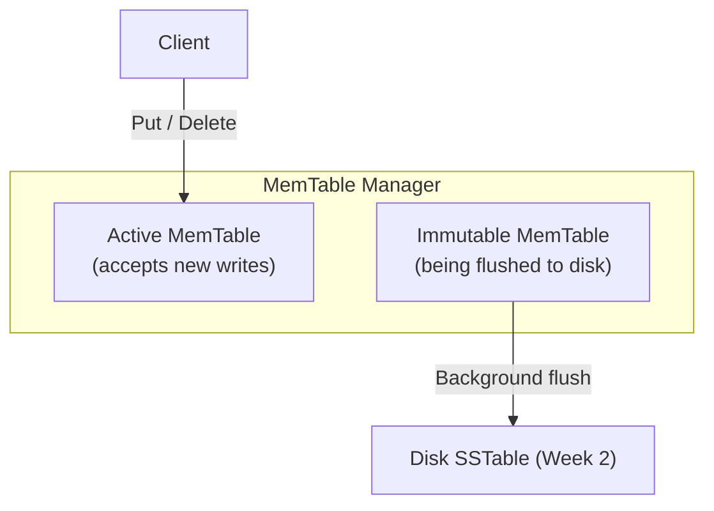
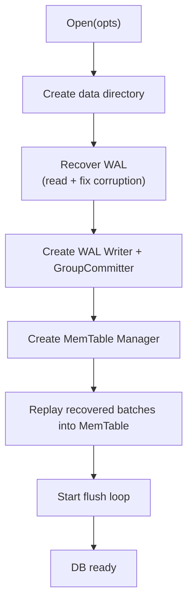

# Week 1: Storage Foundation WAL + MemTable

**Period:** 25 May – 31 May 2026 · **Author:** Sagar Gupta · **Module:** `github.com/sagar0x0/stratum`

---

## Goal

Establish the foundational write path: a call to `Put("k", "v")` must be durable if the process crashes immediately after `Put` returns, reopening the database must still return `"v"`.

---

## Write Path End to End



**Rule:** data hits disk (WAL) *before* memory. Crash after `Put` returns → nothing lost.

---

## What Was Completed

### 1. Project Scaffolding

- Go module `github.com/sagar0x0/stratum` (Go 1.22+), `Makefile`, `.golangci.yml`, GitHub Actions CI.
- Standard layout: `cmd/` (binaries), `internal/` (wal, memtable, …), `docs/weekly/`, `db.go`, `options.go`.

---

### 2. Write-Ahead Log (`internal/wal/`)

#### Block Format

LevelDB-inspired: the file is a sequence of fixed **32 KB blocks**. Each record has a 7-byte header:

```
┌──────────────────────────────────────────────┐
│ CRC32 (4B) │ Length (2B) │ RecordType (1B)   │  ← 7-byte header
├──────────────────────────────────────────────┤
│                  Payload                      │
└──────────────────────────────────────────────┘
```

Records larger than the remaining block space are split using four types: `FULL` `FIRST` `MIDDLE` `LAST`.  
CRC32 uses the **Castagnoli polynomial** (hardware-accelerated on amd64) same as ext4 and iSCSI.

#### Group Commit

`fsync` costs ~1 ms. The `GroupCommitter` collects writes from many goroutines and issues **one fsync per batch**, amortising the cost across all writers.



Flush triggers on whichever comes first: `maxBatchSize` (100 records) or `maxBatchDelay` (10 ms).

#### Crash Recovery

`Recover(path)` runs at `Open()` time:
1. Reads all WAL records, decodes each into a `Batch`.
2. On `ErrCorruptRecord` / `ErrShortRecord` (torn write): stops reading, rewrites only the verified-good batches to a temp file, atomically renames it over the original.
3. Returns recovered batches for replay into the MemTable.

---

### 3. MemTable In-Memory SkipList (`internal/memtable/`)

#### SkipList

Sorted probabilistic structure O(log N) for `Put`, `Get`, range scan.

```
Level 3:  A ──────────────────────────────────────────────── M
Level 2:  A ──────────→ D ────────────────→ I ───────────── M
Level 1:  A ───→ C ───→ D ───→ F ─────────→ I ───→ K ────── M
Level 0:  A → B → C → D → E → F → G → H → I → J → K → L → M
```

- 16 max levels, promotion probability p = 0.25.
- Thread-safe via `sync.RWMutex`; atomic `memSize` tracking without locking.
- `Delete(key)` = `Put(key, nil)` a **tombstone** (GC'd during compaction in Week 3).

#### Dual-Buffer Manager

Avoids write stalls: the manager always holds **two** MemTables.



When `active` hits `maxSize`:
1. Freeze it → becomes `immutable`.
2. Create a fresh `active` instantly **writes never stop**.
3. Background goroutine flushes `immutable`; broadcasts on `sync.Cond` when done.
4. If `immutable` is still busy when the new `active` also fills, writers block (`cond.Wait()`) back-pressure.

An **Iterator** (`SeekToFirst`, `Seek(target)`, `Next`) provides sorted scan over the SkipList used by the SSTable writer in Week 2.

---

### 4. Top-Level DB Interface (`db.go`)

#### Startup `Open()`



| Method | Behaviour |
|--------|-----------|
| `Put(key, value)` | WAL-first via GroupCommitter, then SkipList insert |
| `Get(key)` | active MemTable → immutable MemTable (no disk I/O) |
| `Delete(key)` | Tombstone write via WAL + SkipList |
| `Close()` | Stop Manager → drain GroupCommitter → close WAL |

---

### 5. Test Coverage 29 / 29 Pass

| Package | Highlights |
|---------|-----------|
| `stratum` | `TestDBCrashRecovery` WAL replayed correctly after reopen; `TestDBConcurrentAccess` 10 goroutines × 50 writes, `-race` clean |
| `internal/wal` | `TestRecoverCorruptedLastRecord` bit-flip detected, 9/10 records recovered; `TestRecordSpansBlockBoundary` split records reassembled; `TestGroupCommitConcurrentWriters` single fsync serves many writers |
| `internal/memtable` | `TestConcurrentReadsAndWrites` 4 writers + 8 readers for 2 s, no race; `TestManagerBackPressure` write correctly blocks when immutable full; `TestLargeDataset` 100 k keys inserted and iterated in order |

---

## What's Not Done / Blocked

| Item | Status |
|------|--------|
| Flush to SSTable | Week 2 stub currently sleeps 100 ms |
| WAL rotation | Deferred until SSTable flush works |
| Public `Scan` API | Iterator exists; wrapper not added yet |

No blockers this week.

---

## Plan for Week 2 (1 – 7 June)

**Goal: SSTable format, generation, and Bloom filter.**

- [ ] SSTable binary format: data blocks + index block + footer.
- [ ] `sstable.Writer` serialize MemTable iterator output to file.
- [ ] `sstable.Reader` point lookup via index block + binary search.
- [ ] Wire `sstable.Writer` as the real `flushFn`.
- [ ] `internal/bloom` Bloom filter to skip SSTables on lookup.
- [ ] Tests: SSTable round-trip, Bloom false-positive rate, flush-to-disk integration.

---

## Key Design Decisions

| Decision | Rationale |
|----------|-----------|
| LevelDB block format | Battle-tested; clean block boundaries simplify recovery |
| CRC32 Castagnoli | Hardware-accelerated on amd64; same as ext4/iSCSI |
| Group Commit | Up to 64× fewer fsyncs; critical for write throughput |
| Delete as tombstone | Simplifies write path; compaction GCs in Week 3 |
| Dual-buffer MemTable | Eliminates write stalls; back-pressure only when both buffers full |
