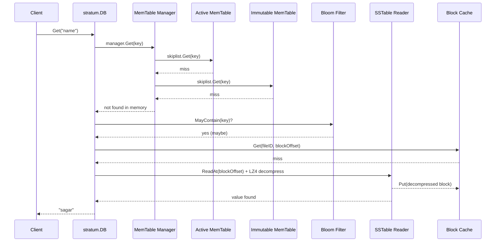
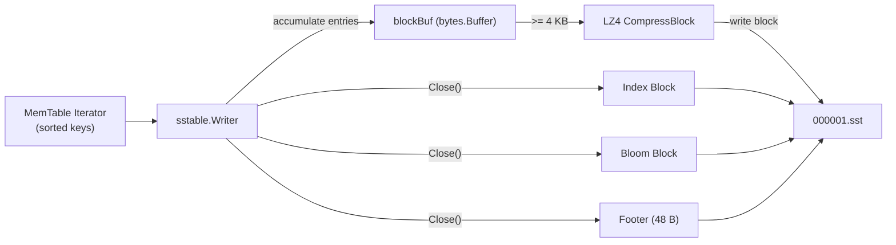
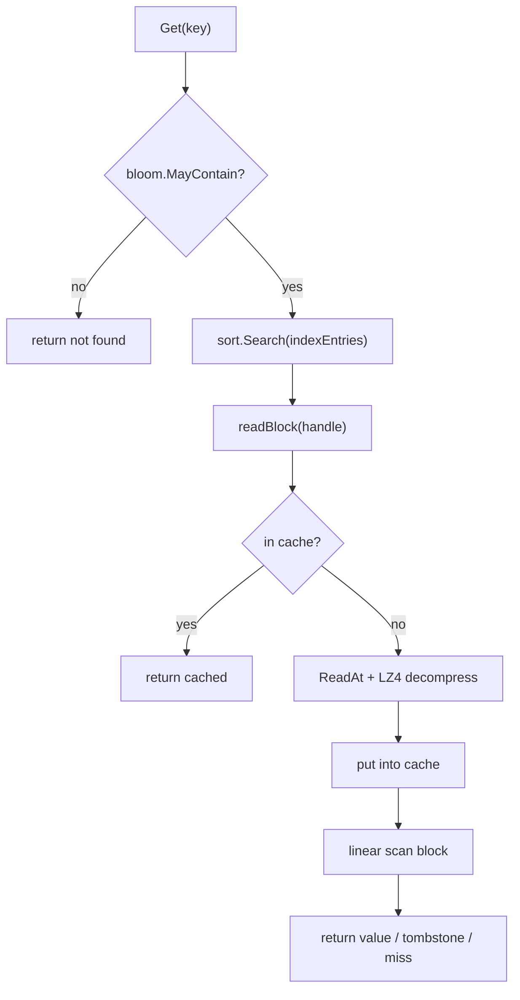
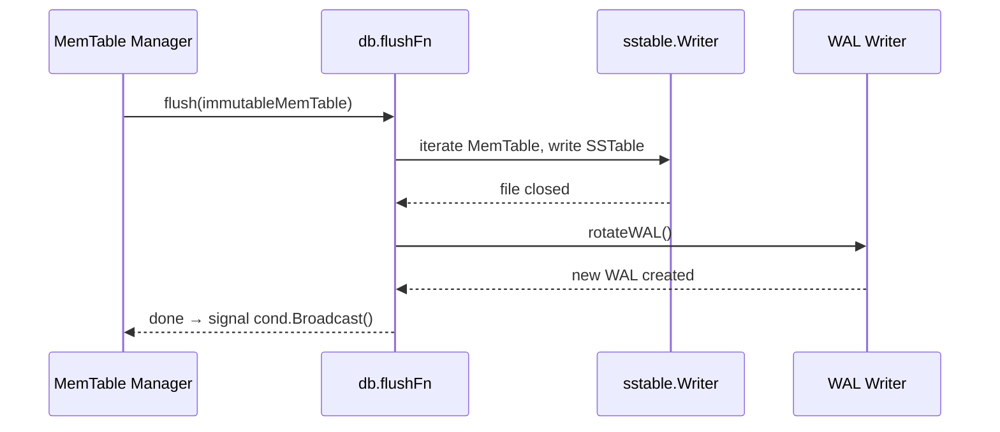

# Week 2: SSTable Format + Flush Pipeline + Read Path

**Period:** 1 Jun – 7 Jun 2026 · **Author:** Sagar Gupta · **Module:** `github.com/sagar0x0/stratum`

---

## Goal

Make data survive a process restart **without** replaying the entire WAL: flush the MemTable to a sorted, compressed file on disk (SSTable), then read it back via an index + Bloom filter. After this week a `Put` → crash → reopen → `Get` round-trip goes through disk, not just the WAL.

---

## Read Path End to End



**Rule:** check memory first (active → immutable MemTable), then disk (newest SSTable → oldest), skipping SSTables whose Bloom filter says "definitely not here".

---

## What Was Completed

### 1. Bloom Filter (`internal/bloom/`)

A space-efficient probabilistic structure: answers "*is key X in this SSTable?*" — **false = certain**, **true = maybe**.

#### How It Works

```
Insert("key1"):
  h1, h2 = murmur3.Sum128("key1")
  for i in 0..nHash-1:
    bitPos = (h1 + i*h2) % numBits
    bits[bitPos/8] |= 1 << (bitPos%8)
```

Uses **double hashing** (`h(i) = h1 + i·h2`) with `murmur3` 128-bit output, avoiding the need to compute `nHash` independent hashes.

| Parameter | Value | Why |
|-----------|-------|-----|
| `bitsPerKey` | 10 | ≈ 1 % false-positive rate |
| `nHash` | `bitsPerKey × ln(2)` ≈ 6 | Optimal hash count |
| Hash function | `murmur3.Sum128` | Fast, excellent distribution |

Serialisation: `[1 byte nHash][variable bits]` — compact enough to embed inside every SSTable.

---

### 2. SSTable Binary Format (`internal/sstable/`)

An SSTable is a single file with the following layout:

```
┌──────────────────────────────────────┐
│ Data Block 0   (LZ4-compressed)      │
│ Data Block 1   (LZ4-compressed)      │
│ …                                    │
│ Data Block N   (LZ4-compressed)      │
├──────────────────────────────────────┤
│ Index Block                          │
├──────────────────────────────────────┤
│ Bloom Block                          │
├──────────────────────────────────────┤
│ Footer  (48 bytes, magic-terminated) │
└──────────────────────────────────────┘
```

#### Data Block (4 KB target)

Each entry is:

```
┌────────────┬────────────┬──────┬───────┐
│ keyLen (4B)│ valLen (4B)│ key  │ value │
└────────────┴────────────┴──────┴───────┘
```

- `valLen = 0xFFFFFFFF` → **tombstone** (key deleted).
- Block is preceded by a 1-byte compression flag: `0x00` = raw, `0x01` = LZ4-compressed.
- Compression is opportunistic: if LZ4 doesn't shrink the block, the raw bytes are written instead.

#### Index Block

One entry per data block. Each entry stores the **last key** of that block + the `BlockHandle`:

```
[keyLen(4)] [key] [offset(8)] [size(8)]
```

#### Footer (48 bytes)

```
┌──────────────────────┬──────────────────────┬───────────────┬────────────┐
│ IndexHandle (16B)    │ BloomHandle (16B)    │ NumEntries(8B)│ Magic (8B) │
└──────────────────────┴──────────────────────┴───────────────┴────────────┘
```

Magic = `0x5354524154554D00` ("STRATUM\0"). If the magic doesn't match, `OpenReader` returns `ErrCorrupt`.

---

### 3. SSTable Writer (`sstable.Writer`)



Key properties:

- **Sorted input required.** The MemTable iterator already provides this.
- **Block flushing** happens automatically when `blockBuf >= blockSize` (4096).
- **LZ4** compression uses `pierrec/lz4/v4`; a reusable `lz4Buf` avoids per-block allocation.
- Every key is also fed to the Bloom filter via `bloom.Add(key)`.
- `Close()` flushes the final partial block, then appends the index, Bloom, and footer.

---

### 4. SSTable Reader (`sstable.Reader`)

`OpenReader(path)` loads the file in three steps:

1. Read the last 48 bytes → decode the **Footer** (validates magic).
2. Use `IndexHandle` to `ReadAt` the **Index Block** → parse into `[]IndexEntry`.
3. Use `BloomHandle` to `ReadAt` the **Bloom Block** → `bloom.DecodeFilter`.

Point lookup (`Get`):



---

### 5. Sharded LRU Block Cache (`sstable.BlockCache`)

Decompressed data blocks are expensive to re-read and re-decompress. The `BlockCache` keeps hot blocks in memory.

```
┌────────────────────────────────────────────────────┐
│                     BlockCache                      │
│  ┌──────────┐ ┌──────────┐ ┌──────────┐ ┌────────┐│
│  │ Shard 0  │ │ Shard 1  │ │ Shard 2  │ │Shard 3 ││
│  │ LRU list │ │ LRU list │ │ LRU list │ │LRU list││
│  │ + map    │ │ + map    │ │ + map    │ │+ map   ││
│  └──────────┘ └──────────┘ └──────────┘ └────────┘│
└────────────────────────────────────────────────────┘
```

| Feature | Detail |
|---------|--------|
| Shards | 4 (reduces lock contention) |
| Eviction | LRU per shard |
| Key | `(fileID, blockOffset)` |
| Default capacity | 8 MB |
| `RemoveFile` | Bulk-evicts all blocks of a deleted SSTable |

Shard selection: `hash = fileID ⊕ (offset × 2654435761)` (Knuth multiplicative hash).

---

### 6. Flush Pipeline & WAL Rotation (`db.go`)

The Week 1 stub (`time.Sleep(100ms)`) was replaced by a real flush:



WAL rotation:

1. Stop GroupCommitter → close current WAL.
2. Rename `wal.log` → `wal_<timestamp>.log`.
3. Create a fresh `wal.log` → restart GroupCommitter.
4. Delete the renamed WAL (data is now safely on the SSTable).

---

### 7. Integrated Read Path (`db.go`)

`Get(key)` now searches three layers:

| Priority | Source | Cost |
|----------|--------|------|
| 1 | Active MemTable | O(log N) in-memory |
| 2 | Immutable MemTable | O(log N) in-memory |
| 3 | SSTables (newest → oldest) | 1 disk read per block (amortised by cache + Bloom skip) |

Tombstone handling: if any layer returns `found = true, value = nil`, `Get` returns `ErrNotFound` — the delete is authoritative.

---

### 8. Configuration (`options.go`)

New fields added to `Options`:

| Field | Default | Purpose |
|-------|---------|---------|
| `SSTableBlockSize` | 4096 | Target data block size in bytes |
| `BloomBitsPerKey` | 10 | ≈ 1 % FPR |
| `BlockCacheSize` | 8 MB | Total block cache capacity |

---

### 9. Test Coverage — 34 / 34 Pass

| Package | Highlights |
|---------|------------|
| `stratum` | `TestDBPutAndGet` end-to-end through SSTable; `TestDBCrashRecovery` WAL replay + SSTable read; `TestDBConcurrentAccess` 10 goroutines, `-race` clean |
| `internal/bloom` | `TestBloomFalsePositiveRate` measured FPR = 0.86 % (target < 1 %); `TestBloomEncodeDecode` serialisation round-trip; `TestBloomEmpty` edge case |
| `internal/sstable` | `TestSSTableRoundTrip` 1000 keys write + read; `TestSSTableBloomSkip` confirms Bloom rejects missing key; `TestSSTableIterator` validates sorted scan + `Seek`; `TestSSTableTombstones` verifies tombstone persistence; `TestBlockCache` LRU eviction + `RemoveFile` |

---

## What's Not Done / Blocked

| Item | Status |
|------|--------|
| Compaction (leveled) | Deferred to Week 3 |
| Manifest / versioning | Deferred to Week 3 |
| Write stall on L0 overflow | Deferred to Week 3 |

No blockers this week.

---

## Key Design Decisions

| Decision | Rationale |
|----------|-----------|
| 4 KB data blocks | Balances read amplification vs. cache granularity; same as ext4 page size |
| LZ4 block compression | Extremely fast decompression (> 4 GB/s); minimal CPU overhead on reads |
| Opportunistic compression | If LZ4 can't shrink a block, write raw — avoids expansion on random data |
| Bloom filter per SSTable | Eliminates > 99 % of unnecessary block reads for missing keys |
| Sharded LRU cache (4 shards) | Reduces mutex contention under concurrent reads without over-complicating |
| `0xFFFFFFFF` tombstone sentinel | Uses an otherwise impossible `valLen` to mark deletes in-band |
| Magic-validated footer | Fast corruption detection; `OpenReader` fails immediately on bad files |
| WAL rotation after flush | Old WAL is deleted once data is durable on SSTable — prevents unbounded growth |
