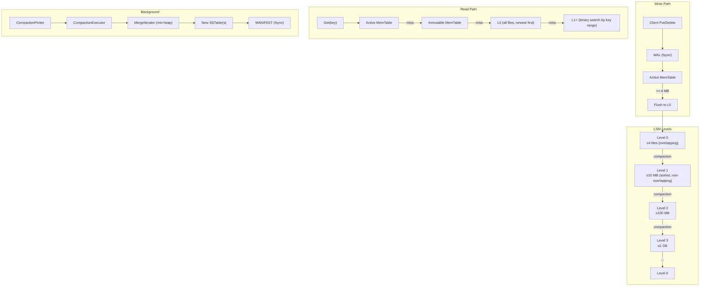
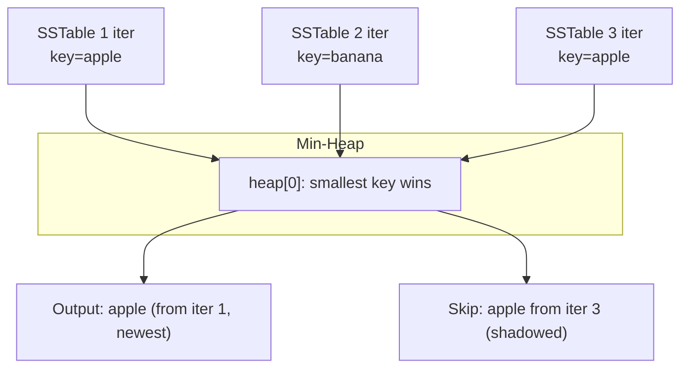
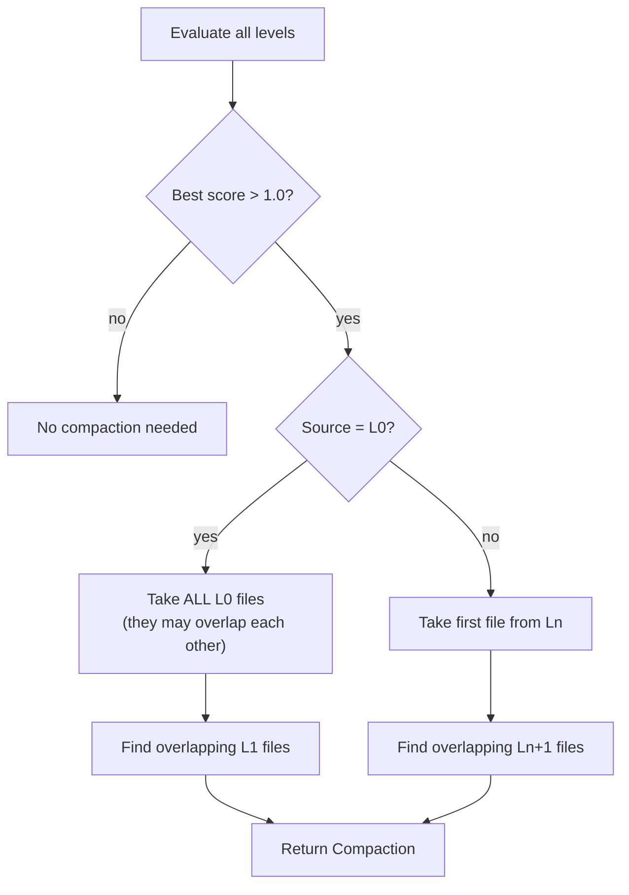
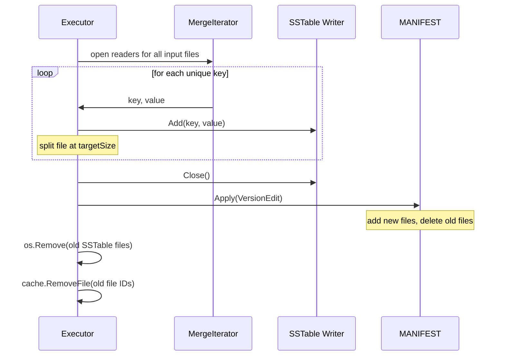
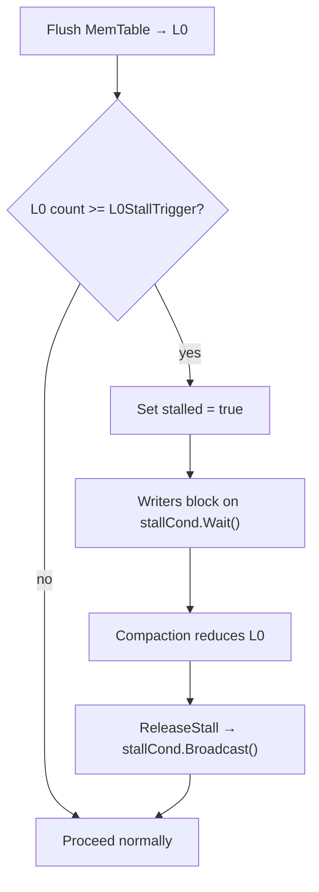
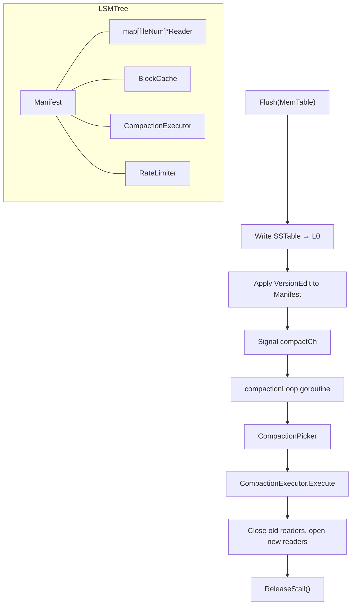
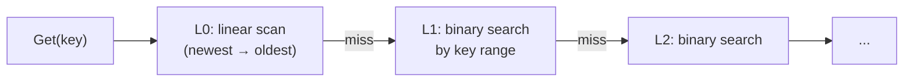
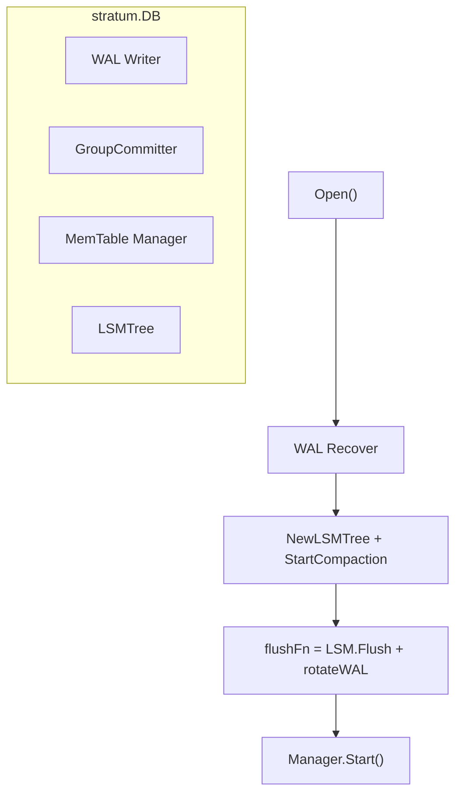

# Week 3: Compaction + Full LSM-Tree

**Period:** 8 Jun – 14 Jun 2026 · **Author:** Sagar Gupta · **Module:** `github.com/sagar0x0/stratum`

---

## Goal

Turn the flat pile of SSTable files from Week 2 into a proper **leveled LSM-Tree**: a background goroutine merges overlapping files into deeper levels, a MANIFEST file tracks which files belong to which level across crashes, and a rate limiter + write stall mechanism prevents compaction from starving foreground I/O.

---

## LSM-Tree Architecture



---

## What Was Completed

### 1. Manifest & Versioning (`internal/lsm/manifest.go`)

The MANIFEST file is the **source of truth** for the LSM level layout. It survives crashes and allows the database to reconstruct which SSTable files belong to which level on restart.

#### Core Types

```
Version        = immutable snapshot of [MaxLevels][]FileMetadata
VersionEdit    = atomic delta: {AddedFiles, DeletedFiles, NextFileNum}
Manifest       = append-only WAL of VersionEdits
```

#### On-Disk Format

Each `VersionEdit` is length-prefixed:

```
┌───────────┬──────────────────────────┐
│ len (4B)  │ VersionEdit (variable)   │
├───────────┼──────────────────────────┤
│ len (4B)  │ VersionEdit (variable)   │
│ …         │ …                        │
└───────────┴──────────────────────────┘
```

A `VersionEdit` encodes as:

```
[NextFileNum(8)] [numDeleted(4)] [deleted...] [numAdded(4)] [added...]

Each deleted:  [level(4)][fileNum(8)]
Each added:    [level(4)][fileNum(8)][fileSize(8)][numEntries(8)]
               [smallKeyLen(4)][smallKey][largeKeyLen(4)][largeKey]
```

#### Recovery

`OpenManifest()` reads the entire file, replays every `VersionEdit` in order, and reconstructs the current `Version` in memory. This is the same pattern as LevelDB/RocksDB MANIFEST recovery.


---

### 2. Level Helpers (`internal/lsm/level.go`)

Utility functions used by the compaction picker:

| Function | Purpose |
|----------|---------|
| `GetOverlappingFiles(files, smallest, largest)` | Returns files whose key range intersects `[smallest, largest]` |
| `SortBySmallestKey(files)` | Sorts `[]FileMetadata` by `SmallestKey` |
| `TargetSize(level)` | Returns max size for a level: `10 MB × 10^(level-1)` |
| `CompactionScore(level, files)` | L0: `count / 4`, L1+: `totalSize / targetSize` — score > 1.0 triggers compaction |

Level sizing follows the RocksDB model:

```
L0:  file-count trigger (4 files)
L1:  10 MB
L2:  100 MB
L3:  1 GB
L4:  10 GB
L5:  100 GB
L6:  1 TB
```

---

### 3. Merge Iterator (`internal/lsm/merge_iterator.go`)

Multi-way merge of N sorted iterators using a **min-heap**.



Key properties:

- **Duplicate suppression:** when multiple iterators have the same key, the one with the lowest index wins (newest data). Older duplicates are silently advanced past.
- **Stable ordering:** ties broken by iterator index, ensuring the newest version of a key is always returned.
- Implements the `Iterator` interface: `SeekToFirst()`, `Seek(target)`, `Next()`, `Key()`, `Value()`.

---

### 4. Compaction Engine (`internal/lsm/compaction.go`)

Two components work together: the **Picker** chooses what to compact, and the **Executor** performs the merge.

#### CompactionPicker

Scans all levels, calculates `CompactionScore`, picks the level with the highest score > 1.0.



L0 is special: since L0 files can overlap each other (they come from independent MemTable flushes), we must include **all** L0 files when compacting to L1.

#### CompactionExecutor



File splitting: when the estimated output size reaches `TargetSize(outputLevel)`, the current SSTable is closed and a new one is opened. This keeps L1+ files at a manageable size.

---

### 5. Rate Limiter (`internal/lsm/rate_limiter.go`)

A **token-bucket** rate limiter that throttles background compaction I/O to prevent it from starving foreground reads and writes.

```
┌─────────────────────────────────────────┐
│              Token Bucket                │
│  capacity:   bytesPerSec                 │
│  refill:     bytesPerSec/10 every 100ms  │
│  on Request: block on sync.Cond if empty │
└─────────────────────────────────────────┘
```

| Parameter | Default | Purpose |
|-----------|---------|---------|
| `CompactionRateMB` | 50 | MB/s cap on compaction writes |
| Refill interval | 100 ms | Smooth refill, 10× per second |

If `CompactionRateMB = 0`, no limiter is created and compaction runs unbounded.

---

### 6. Write Stall (`internal/lsm/write_stall.go`)

When L0 accumulates too many files (compaction can't keep up), new flushes must **wait** — otherwise L0 would grow without bound and reads would degrade.



| Parameter | Default | Purpose |
|-----------|---------|---------|
| `L0StallTrigger` | 12 | Max L0 files before stalling flushes |

---

### 7. LSM Orchestrator (`internal/lsm/lsm.go`)

The `LSMTree` struct ties everything together:



#### Flush Path

1. `WaitForStall()` — block if L0 is overloaded.
2. Allocate a new file number from the Manifest.
3. Create an `sstable.Writer`, iterate the MemTable, write to `{fileNum}.sst`.
4. Open an `sstable.Reader` for the new file, register in the readers map.
5. Apply a `VersionEdit` (add file to L0) to the Manifest.
6. Signal the compaction channel.

#### Read Path (`Get`)

1. **L0:** scan all files newest-first (files may overlap).
2. **L1+:** binary search over file key ranges (files are non-overlapping and sorted).
3. Each file's Bloom filter is checked before any block read.



#### Background Compaction

A single goroutine runs a `select` loop on `compactCh` and `stopCh`. On each signal it runs `doCompaction()` which repeatedly picks and executes compactions until no level has a score > 1.0.

---

### 8. DB Refactor (`db.go`)

The top-level `DB` struct was refactored to use `LSMTree`:



| Method | Behaviour |
|--------|-----------|
| `Put(key, value)` | WAL → GroupCommitter → MemTable (unchanged from Week 1) |
| `Get(key)` | MemTable → LSMTree.Get (Bloom → cache → disk) |
| `Delete(key)` | Tombstone write via WAL + MemTable (unchanged) |
| `Close()` | Stop Manager → GroupCommitter → WAL → LSMTree (closes all readers + Manifest) |

---

### 9. Configuration (`options.go`)

New fields added to `Options`:

| Field | Default | Purpose |
|-------|---------|---------|
| `CompactionRateMB` | 50 | I/O rate cap for background compactions (MB/s) |
| `L0StallTrigger` | 12 | Stall flushes when L0 file count reaches this |

---

### 10. Test Coverage — 37 / 37 Pass

| Package | Highlights |
|---------|------------|
| `stratum` | `TestDBPutAndGet`, `TestDBDelete`, `TestDBCrashRecovery`, `TestDBConcurrentAccess` — all pass through the full LSM stack now |
| `internal/lsm` | `TestFlushToL0`, `TestManifestRecovery`, `TestCompactionStats`, `TestOneMillion` — 1,000,000 keys written → flushed → all verified readable without data loss. |
| `internal/bloom` | 5 tests (cached) |
| `internal/sstable` | 5 tests (cached) |
| `internal/memtable` | 11 tests (cached) |
| `internal/wal` | 14 tests (cached) |

#### Integration Test Performance

```
TestOneMillion:
  Wrote 1,000,000 keys in 10.7 s
  Read  1,000,000 keys in 12.3 s
```

### 11. Tech Team Review Enhancements

Based on code review feedback, the following were successfully implemented to close out Week 3:

1. **Compaction Metrics & Observability**: Integrated runtime counters (bytes compacted, compaction duration, stall time, pending compactions) into `CompactionStats` to aid production debugging.
2. **Tombstone Garbage Collection**: Implemented dropping of delete markers during deepest-level compactions where no older versions can exist, minimizing storage bloat.
3. **Compaction Prioritization**: Upgraded file selection within a level to pick the largest file first, preventing massive compactions from starving smaller ones.
4. **Stress Testing**: Expanded the integration test matrix to include a `TestOneMillion` 1-million key stress test with strict durability checks.

---

## What's Not Done / Blocked

| Item | Status |
|------|--------|
| Public `Scan` / range query API | Iterator infra exists; wrapper not exposed yet (Planned for Week 5) |
| gRPC / HTTP server layer | Deferred to Week 4 |

No blockers this week.

---

## Key Design Decisions

| Decision | Rationale |
|----------|-----------|
| 7 levels (MaxLevels) | Handles up to ~1 TB with 10× size ratio; same as RocksDB default |
| L0 file-count trigger (4) | Limits read amplification in L0 (must scan all files linearly) |
| 10× level size ratio | Standard RocksDB heuristic; balances write amplification vs. space amplification |
| MANIFEST as append-only WAL | Crash-safe: replaying edits reconstructs exact level layout without scanning the data directory |
| Min-heap merge iterator | O(N log K) merge for K input files; automatically resolves shadowed keys |
| Token-bucket rate limiter | Smooth I/O pacing; prevents compaction bursts from causing read latency spikes |
| Write stall on L0 overflow | Essential safety valve; without it, unbounded L0 growth degrades reads to O(N) per file |
| Compaction retains tombstones | Prevents "data resurrection" if a tombstone is dropped before the key's older version is compacted away |
