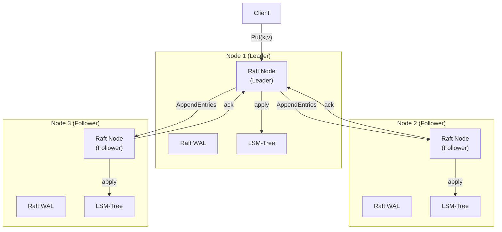
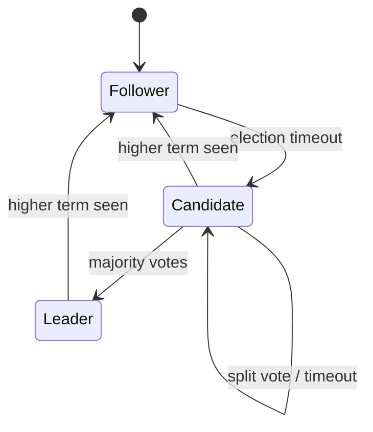
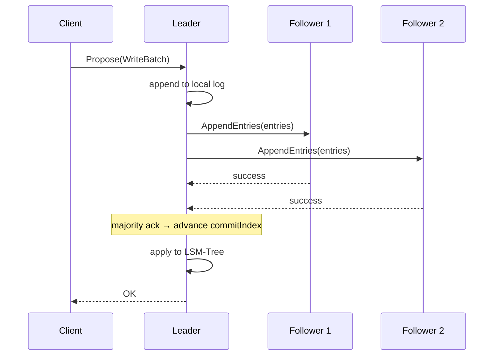
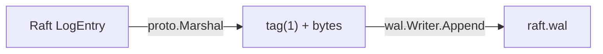

# Week 4: Raft Consensus with Leader Leases

**Period:** 15 Jun – 21 Jun 2026 · **Author:** Sagar Gupta · **Module:** `github.com/sagar0x0/stratum`

---

## Goal

Replicate the storage engine's state across a 3-node cluster using Raft consensus. Writes are linearizable (committed only after majority ack), and reads are served locally by the leader via time-bounded leader leases without a quorum round-trip.

---

## Raft Architecture



---

## What Was Completed

### 1. Protocol Buffers (`proto/raft.proto`)

Defined the three standard Raft RPCs with Protobuf:

| RPC | Purpose |
|-----|---------|
| `RequestVote` | Candidate asks peers for votes during election |
| `AppendEntries` | Leader replicates log entries + heartbeats |
| `InstallSnapshot` | Leader sends full snapshot to lagging follower |

Generated Go + gRPC stubs via `protoc --go_out --go-grpc_out`.

---

### 2. Raft Core (`internal/raft/raft.go`)

The `Node` struct manages the complete Raft state machine with three states:



#### Key State

```
Node {
  currentTerm   uint64        // monotonically increasing term
  votedFor      string        // at most one vote per term
  log           []*LogEntry   // 1-indexed (dummy entry at 0)
  commitIndex   uint64        // highest committed entry
  lastApplied   uint64        // highest applied to state machine
  nextIndex     map[peer]idx  // leader-only: next entry to send each peer
  matchIndex    map[peer]idx  // leader-only: highest replicated entry per peer
  leaseTimeout  time.Time     // leader lease expiry
}
```

#### Leader Election

1. Follower's election timer fires (randomised 150–300 ms).
2. Increments `currentTerm`, votes for self, persists state via WAL.
3. Sends `RequestVote` to all peers in parallel.
4. On majority → `becomeLeader()`: initialises `nextIndex`/`matchIndex`, starts heartbeat timer.
5. On higher term → `stepDown()`: reverts to Follower.

#### Log Replication



The leader sends entries to each follower based on their `nextIndex`. On success, `matchIndex` advances. On failure (log mismatch), `nextIndex` decrements and retries — the classic Raft back-off.

#### Commit Index Advancement

The leader scans from the end of the log backward. For each index *i*, if a majority of `matchIndex[peer] >= i` **and** `log[i].Term == currentTerm`, then `commitIndex = i`. Applied entries are pushed through the `applyCh` channel to the state machine.

---

### 3. Leader Leases

The leader tracks a `leaseTimeout` timestamp. On a successful heartbeat quorum (majority of peers ack), the lease is extended:

```
leaseTimeout = time.Now() + LeaseDuration
```

While the lease is valid, the leader can serve reads locally without a quorum round-trip. If the leader cannot confirm its lease (no majority heartbeat ack), it steps down — preventing stale reads during a partition.

| Parameter | Default | Purpose |
|-----------|---------|---------|
| `ElectionMin` | 150 ms | Lower bound of randomised election timeout |
| `ElectionMax` | 300 ms | Upper bound of randomised election timeout |
| `HeartbeatTime` | 50 ms | Heartbeat interval (must be << election timeout) |
| `LeaseDuration` | 100 ms | `ElectionMin - max_clock_skew` |

---

### 4. Raft WAL (`internal/raft/wal.go`)

The Raft log is persisted to a dedicated WAL (separate from the storage engine's WAL) using the existing `internal/wal.Writer`:



`SaveState(term, votedFor)` persists hard state before responding to any RPC — required for Raft safety.

---

### 5. gRPC Transport (`internal/transport/grpc.go`)

`GRPCTransport` implements the `raft.Transport` interface, managing a connection pool (`map[peer]*grpc.ClientConn`) with lazy initialisation:

| Method | Maps To |
|--------|---------|
| `RequestVote(ctx, peer, req)` | `RaftService.RequestVote` gRPC call |
| `AppendEntries(ctx, peer, req)` | `RaftService.AppendEntries` gRPC call |

Connections use `insecure.NewCredentials()` for the prototype. Each connection is reused across calls to the same peer.

---

## What's Not Done / Blocked

| Item | Status |
|------|--------|
| `InstallSnapshot` RPC handler | P2 — log replay suffices on localhost cluster |
| Membership changes | P2 — fixed 3-node cluster for the prototype |
| Full integration with `db.go` | Deferred to Week 6 (Disaggregation) |

No blockers this week.

---

## Key Design Decisions

| Decision | Rationale |
|----------|-----------|
| Custom Raft from scratch | Maximises learning; follows the project's original ethos |
| Separate WAL for Raft log | Decouples consensus durability from storage engine durability — each can be tuned independently |
| Randomised election timeout (150–300 ms) | Standard Raft heuristic; prevents split votes in most cases |
| Lease = `ElectionMin - δ` | TrueTime-lite approach (CockroachDB-style); bounded clock skew assumption allows local linearizable reads |
| `Transport` interface abstraction | Allows swapping gRPC for in-memory transport in unit tests without changing Raft logic |
| 1-indexed log with dummy entry | Simplifies `prevLogIndex` / `prevLogTerm` checks — no special-casing for empty log |
