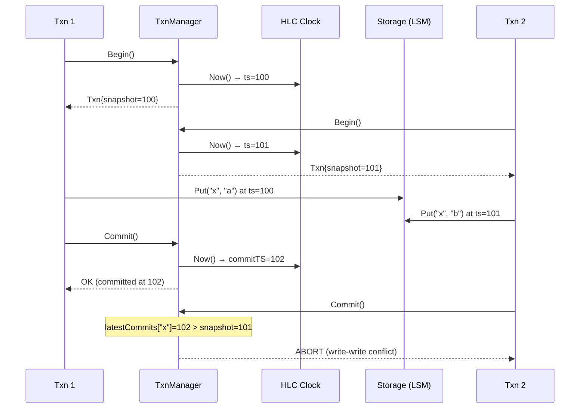
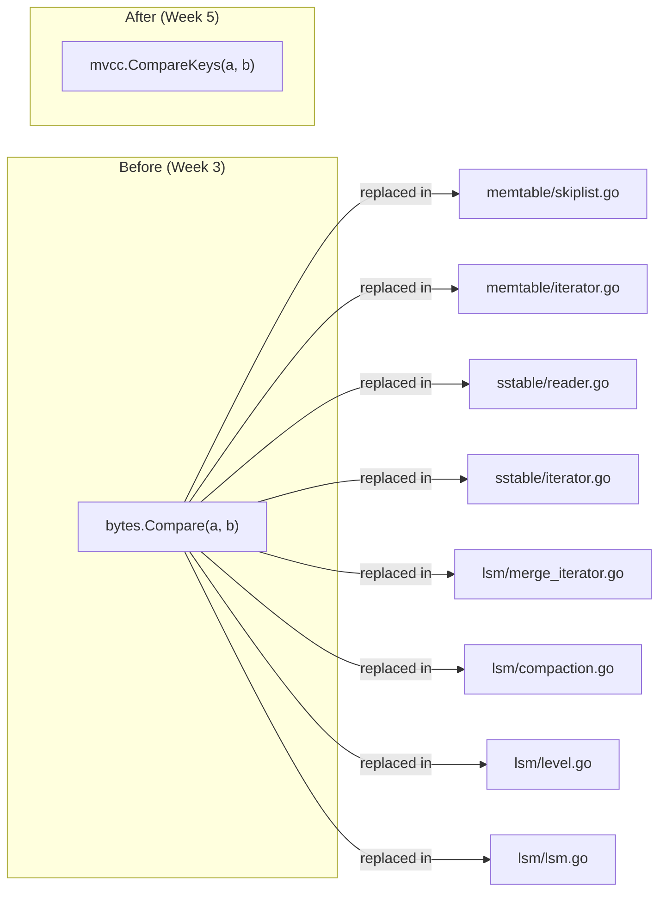
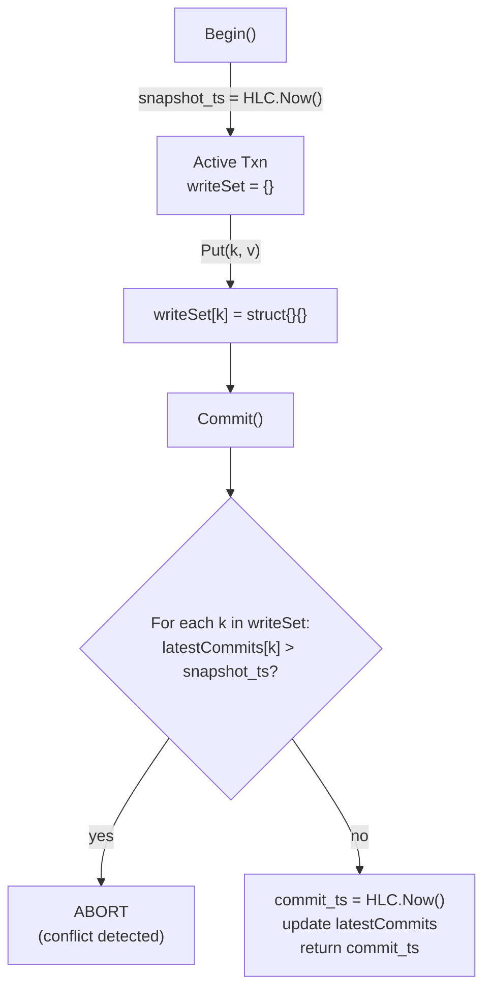
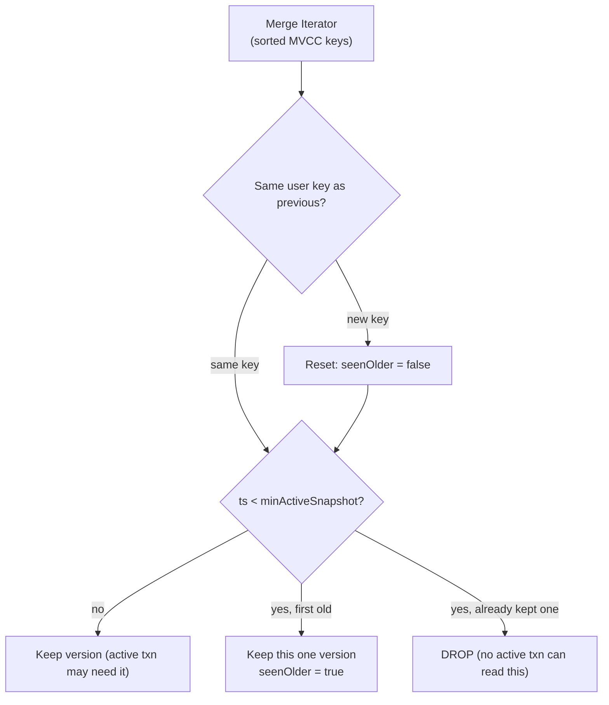

# Week 5: MVCC + Snapshot Isolation

**Period:** 22 Jun – 28 Jun 2026 · **Author:** Sagar Gupta · **Module:** `github.com/sagar0x0/stratum`

---

## Goal

Layer multi-version concurrency control (MVCC) on top of the storage engine so that every key carries a timestamp. Readers see a consistent point-in-time snapshot without blocking writers, and concurrent write-write conflicts are detected at commit time using first-writer-wins.

---

## MVCC Read/Write Flow



---

## What Was Completed

### 1. Hybrid Logical Clock (`internal/hlc/hlc.go`)

Provides monotonically increasing timestamps that combine physical wall time with a logical counter for causal ordering within the same millisecond.

```
┌────────────────────────────────────────────────┐
│  HLC Timestamp (64 bits)                        │
│  [  wall time (ms)  : 48 bits ] [ logical : 16 ]│
└────────────────────────────────────────────────┘
```

| Method | Behaviour |
|--------|-----------|
| `Now()` | If wall clock advanced → reset logical to 0. Otherwise → increment logical. Returns `(wall << 16) \| logical`. |
| `Update(remote)` | Merge with a remote timestamp: advance wall to `max(local, remote, now)`, adjust logical counter. Ensures causal ordering across nodes. |

Key property: two calls to `Now()` within the same millisecond produce **different** timestamps thanks to the logical counter — no duplicates.

---

### 2. MVCC Key Encoding (`internal/mvcc/key.go`)

Every key in the storage engine is now an MVCC key: `userKey || ~timestamp`.

```
┌───────────────────────────────────────────────────┐
│  user key bytes (variable)  │  ^timestamp (8 B)    │
└───────────────────────────────────────────────────┘
                                ↑ bitwise inversion
```

The `~` (bitwise NOT) inverts the timestamp so that **newer** versions sort **first** in ascending byte order. This means a standard lexicographic scan naturally returns the latest version of a key before older ones.

| Function | Purpose |
|----------|---------|
| `EncodeKey(userKey, ts)` | Appends `^ts` (8 bytes, big-endian) to user key |
| `DecodeKey(mvccKey)` | Splits off last 8 bytes, inverts back to original ts |
| `CompareKeys(a, b)` | Compares user key ascending, then timestamp descending |
| `UserKey(mvccKey)` | Extracts just `mvccKey[:len-8]` |
| `SameUserKey(a, b)` | `bytes.Equal` on the user key portions |

---

### 3. Storage Engine Migration

All three storage layers were updated to use `mvcc.CompareKeys` instead of `bytes.Compare`:



| Package | Files Changed | What Changed |
|---------|---------------|--------------|
| `internal/memtable` | `skiplist.go`, `iterator.go` | Skip list traversal + Seek use MVCC ordering |
| `internal/sstable` | `reader.go`, `iterator.go` | Binary search over index block + Seek use MVCC ordering |
| `internal/lsm` | `lsm.go`, `compaction.go`, `merge_iterator.go`, `level.go` | Level file lookup, merge ordering, overlap detection |

All 37 existing tests pass after migration (1 test updated: `TestSSTableIterator` Seek target adjusted for MVCC-aware ordering).

---

### 4. Transaction Manager (`internal/mvcc/txn.go`)

Manages the full transaction lifecycle with **first-writer-wins** conflict detection.



| Component | Detail |
|-----------|--------|
| `activeTxns` | `map[uint64]struct{}` — tracks all in-flight snapshot timestamps |
| `latestCommits` | `map[string]uint64` — most recent commit timestamp per key |
| `Begin()` | Allocates snapshot timestamp via `HLC.Now()`, registers in `activeTxns` |
| `Commit()` | Checks write-set against `latestCommits`. O(write-set size) per commit |
| `Abort()` | Removes snapshot from `activeTxns` |
| `MinActiveSnapshot()` | Returns oldest active timestamp — used by compaction GC |

**Isolation guarantees:**
- ✅ No dirty reads — uncommitted writes are invisible
- ✅ No non-repeatable reads — snapshot timestamp is fixed at `Begin()`
- ⚠️ Write skew is permitted (this is snapshot isolation, not serializable)

---

### 5. MVCC Garbage Collection in Compaction

The `CompactionExecutor` now prunes old versions during the merge pass, using the `MinActiveSnapshot` callback from the transaction manager:



Rules:
1. **Versions newer than `minActiveSnapshot`** — always kept (an active transaction may read them).
2. **First version older than `minActiveSnapshot`** — kept (it's the "floor" version for older snapshots).
3. **Additional older versions** — dropped (unreachable by any active transaction).
4. **Tombstones at the deepest level** — dropped (no older version can exist below).

---

## What's Not Done / Blocked

| Item | Status |
|------|--------|
| MVCC-aware `Scan` / range query | Iterator infra exists; MVCC-filtered wrapper deferred to Week 6 |
| Read-only transaction optimisation | Planned — zero-overhead, never abort |
| Full integration of Raft + MVCC in `db.go` | Deferred to Week 6 (Disaggregation) |

No blockers this week.

---

## Key Design Decisions

| Decision | Rationale |
|----------|-----------|
| `userKey \|\| ~timestamp` encoding | Single byte-order comparator handles both user key and version ordering — no need for a custom SSTable format |
| 48-bit wall + 16-bit logical in HLC | 65K events/ms before overflow; sufficient for a single-node prototype |
| First-writer-wins conflict detection | O(write-set) per commit; simple, well-understood, matches CockroachDB/Spanner approach |
| In-memory `latestCommits` map | Avoids disk I/O during conflict checks; bounded by key cardinality, not version count |
| GC piggybacked on compaction | No separate GC goroutine — version pruning is amortised across compaction I/O that's happening anyway |
| `minActiveSnapshot` as callback | Decouples compaction from the transaction manager; compactor doesn't need to import `mvcc` types directly |
