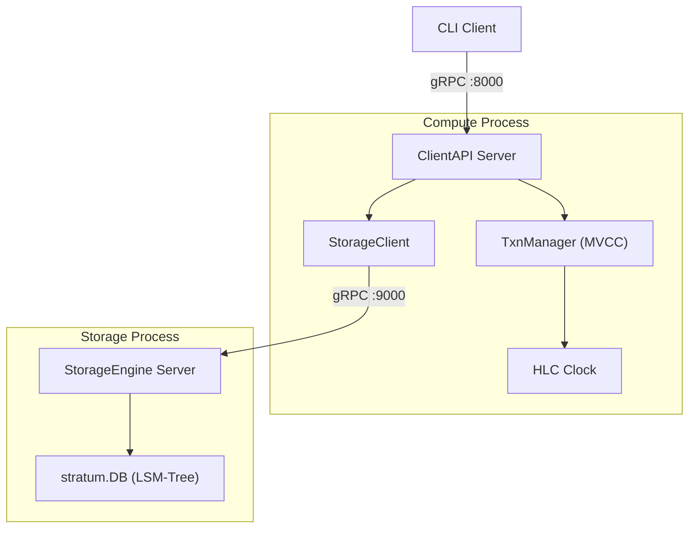
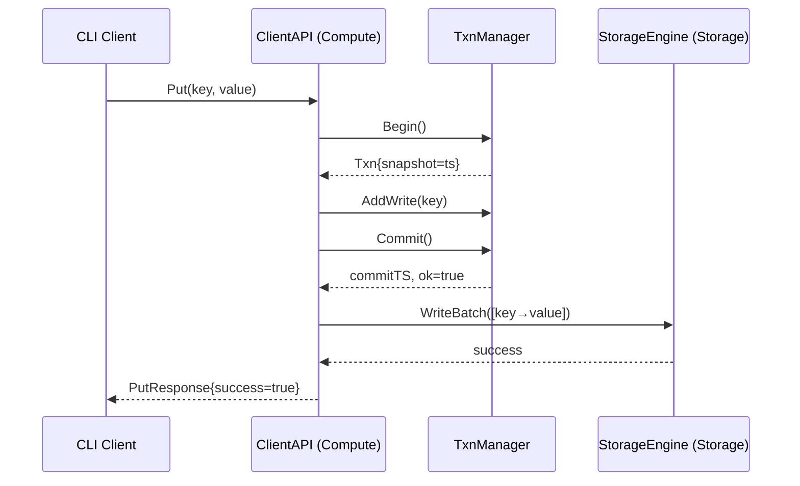

# Week 6: Compute-Storage Disaggregation

**Period:** 29 Jun – 5 Jul 2026 · **Author:** Sagar Gupta · **Module:** `github.com/sagar0x0/stratum`

---

## Goal

Decouple the transaction coordinator from the storage engine into separate processes communicating over gRPC. Demonstrate that compute and storage can be scaled independently.

---

## Disaggregated Architecture

---

## What Was Completed

### 1. Protobuf Definitions

| Proto | Service | RPCs |
|-------|---------|------|
| `proto/storage/storage.proto` | `StorageEngine` | `WriteBatch`, `Get`, `Scan` (streaming), `Snapshot` |
| `proto/client/client.proto` | `ClientAPI` | `Put`, `Get`, `Delete`, `Scan` (streaming) |

Generated Go + gRPC stubs via `make proto`.

---

### 2. Storage Server (`internal/transport/server.go`)

Wraps `stratum.DB` behind the `StorageEngine` gRPC service. Runs as a standalone process via `cmd/storage/main.go`.

| RPC | Implementation |
|-----|----------------|
| `WriteBatch` | Converts proto `PutOp`/`Deletes` → `wal.Batch`, calls `db.WriteBatch()` |
| `Get` | Calls `db.Get(key)`, returns `found=false` on `ErrNotFound` |
| `Scan` | Stub — `codes.Unimplemented` (P1 scope) |
| `Snapshot` | Stub — `codes.Unimplemented` (P2 scope) |

A new `WriteBatch` method was added to both `memtable.Manager` and `stratum.DB` to handle atomic multi-key writes from the compute layer.

---

### 3. Storage Client (`internal/transport/client.go`)

gRPC client with multiplexed connection (single `grpc.ClientConn` handles all concurrent streams). Provides typed helpers:

| Method | Purpose |
|--------|---------|
| `WriteBatch(ctx, puts, deletes)` | Sends a batch write to storage |
| `Get(ctx, key, timestamp)` | Point lookup at MVCC timestamp |
| `Close()` | Tears down connection |

---

### 4. Client API (`internal/transport/client_api.go`)

The compute node's public-facing gRPC service. Orchestrates MVCC transactions:

---

### 5. Entrypoints

| Binary | Flag | Default | Purpose |
|--------|------|---------|---------|
| `cmd/storage` | `-addr` | `:9000` | Storage gRPC listen address |
|               | `-dir` | `data/storage` | LSM data directory |
| `cmd/compute` | `-client-addr` | `:8000` | ClientAPI listen address |
|               | `-storage-addr` | `localhost:9000` | Storage node to connect to |
| `cmd/client`  | `-addr` | `localhost:8000` | Compute node address |
|               | `-op` | — | `put`, `get`, or `delete` |
|               | `-key` | — | Key to operate on |
|               | `-val` | — | Value (for `put`) |

---

## What's Not Done / Blocked

| Item | Status |
|------|--------|
| Raft-integrated propose path | Compute currently writes directly to storage after MVCC commit; Raft propose path deferred |
| Connection pooling tuning | Single `grpc.ClientConn` with default stream limits; sufficient for prototype |
| Latency overhead measurement | Planned for Week 8 benchmarks |

No blockers this week.

---

## Key Design Decisions

| Decision | Rationale |
|----------|-----------|
| Co-located Raft replica + storage node | Keeps cross-network hops to one (compute → storage on localhost) |
| Single `grpc.ClientConn` for multiplexing | gRPC natively multiplexes RPCs over one HTTP/2 connection; no custom pool needed |
| `WriteBatch` as atomic unit | Matches Raft's apply loop semantics — one committed log entry = one `WriteBatch` RPC |
| Static config for discovery | Sufficient for 3-node prototype; extensible to etcd-based discovery later |
| Separate `ClientAPI` from `StorageEngine` | Clean separation: clients never talk to storage directly, enabling independent scaling |
