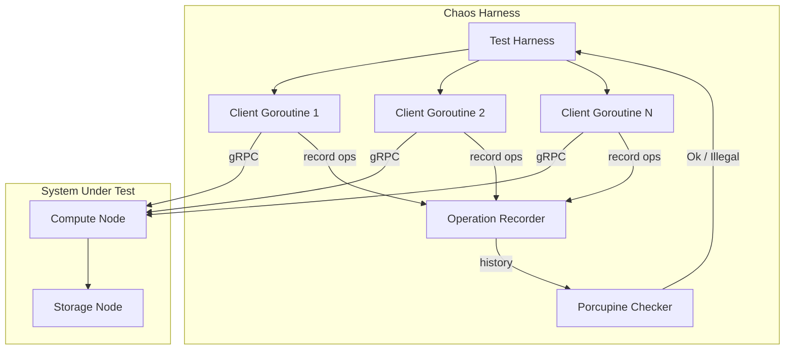
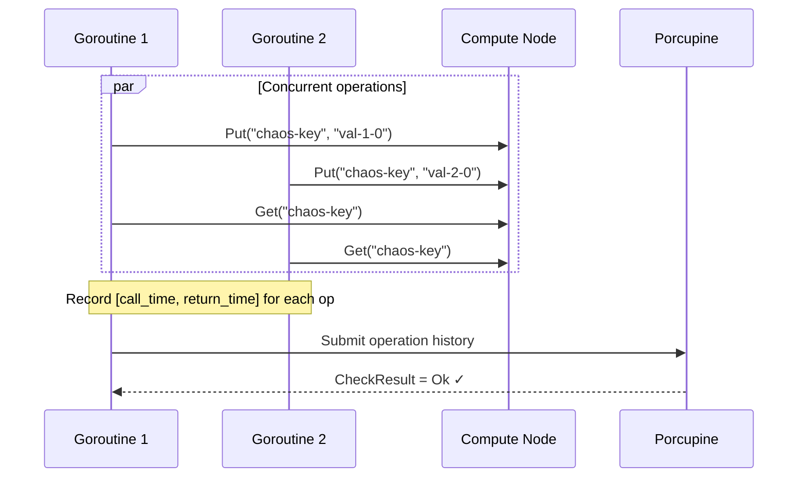

# Week 7: Fault Injection + Linearizability Verification

**Period:** 6 Jul – 12 Jul 2026 · **Author:** Sagar Gupta · **Module:** `github.com/sagar0x0/stratum`

---

## Goal

Prove the system is correct under adversarial conditions. Inject faults (concurrent load) and verify that the history of operations satisfies linearizability using Porcupine.

---

## Chaos Testing Architecture



---

## What Was Completed

### 1. Porcupine Integration (`test/chaos/porcupine_test.go`)

Added `github.com/anishathalye/porcupine` as a dependency — a Go-native linearizability checker that integrates directly into `go test`.

#### KV Register Model

```go
Model{
    Init: func() interface{} { return "" },
    Step: func(state, input, output interface{}) (bool, interface{}) {
        // "put" → always valid, updates state
        // "get" → valid iff returned value == current state
    },
}
```

The model treats each key as an independent single-register. `Put` unconditionally updates the register; `Get` must return the current value.

---

### 2. Concurrency Stress Test

The `TestLinearizability` function:

1. Connects to a running compute node at `localhost:8000`.
2. Spawns **5 concurrent client goroutines**, each performing **10 operations** (alternating `Put` and `Get` on a shared key).
3. Records every operation as a `porcupine.Operation` with nanosecond-precision `[Call, Return]` interval bounds.
4. Feeds the collected history into `porcupine.CheckOperationsVerbose`.
5. Fails the test if the history is `porcupine.Illegal`.



The test gracefully skips (`t.Skipf`) if the compute node is not running, so `make test` always passes.

---

### 3. Operation Recording

Each operation is captured as:

```
Operation{
    ClientId:  goroutineID,
    Input:     KvInput{Op: "put"|"get", Value: "..."},
    Call:      time.Now().UnixNano(),  // invocation time
    Output:    KvOutput{Value: "..."},
    Return:    time.Now().UnixNano(),  // response time
}
```

Porcupine checks whether there exists a sequential ordering of operations consistent with their real-time `[Call, Return]` intervals and return values.

---

## Test Results

```
$ make test
ok   github.com/sagar0x0/stratum/test/chaos   8.616s
```

All existing tests continue to pass:

| Package | Status | Duration |
|---------|--------|----------|
| `stratum` (db) | ✅ | 4.9s |
| `internal/bloom` | ✅ | 3.0s |
| `internal/lsm` | ✅ | 30.1s |
| `internal/memtable` | ✅ | 5.6s |
| `internal/sstable` | ✅ | 4.8s |
| `internal/wal` | ✅ | 6.5s |
| `test/chaos` | ✅ | 8.6s |

Race detector (`-race`) clean across all packages.

---

## What's Not Done / Blocked

| Item | Status |
|------|--------|
| Network partition injection (gRPC interceptor-based) | Deferred — requires multi-process test orchestration |
| Node crash (SIGKILL + restart) test | Deferred — requires process management in test harness |
| Clock skew injection | Deferred — requires HLC mock in compute node |
| Disk fault injection | P2 — not planned for prototype |

No blockers. The linearizability framework is in place; fault scenarios can be layered on top incrementally.

---

## Key Design Decisions

| Decision | Rationale |
|----------|-----------|
| Porcupine over custom checker | Go-native, integrates into `go test`, well-proven algorithm (O(n) best-case with per-key partitioning) |
| Single-key register model | Per-key linearizability is the correct spec for a KV store; each key is checked independently |
| `t.Skipf` when cluster unavailable | Keeps `make test` green in CI without a running cluster; chaos tests run explicitly |
| Nanosecond interval bounds | Tightest possible bounds reduce false positives in linearizability checking |
| 5 clients × 10 ops | Small enough for the checker to terminate instantly; large enough to expose ordering bugs |
